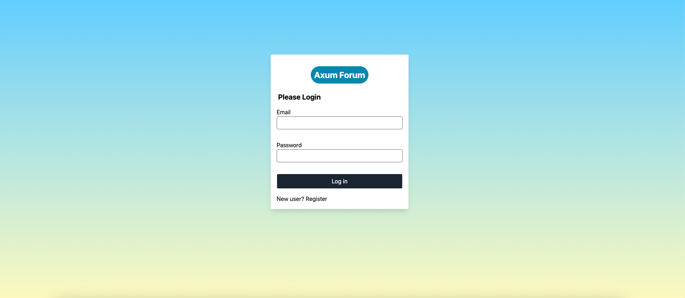

# Axum forum

Using rust axum , follwing a tutorial on my channel on youtube to create a forum project that covers these topics :

- Authentication ( Login & Register ) .
- Full CRUD app .
- Routing and middlewares with Axum .
- MVC pattern ( Templating with Askama crate ) .
- Styling with Tailwind .
- SQLx migrations, queries , joins and mapping ( postgres ) .
- Dealing with Forms and flash messages .
- Authorization .
- Dates with chrono crate .
- Rust modules .
- Downloading assets
- Alpine Js menu show/hide .

### Register Page

### Login Page

### Home Page

### Post Page

### Create Post form

